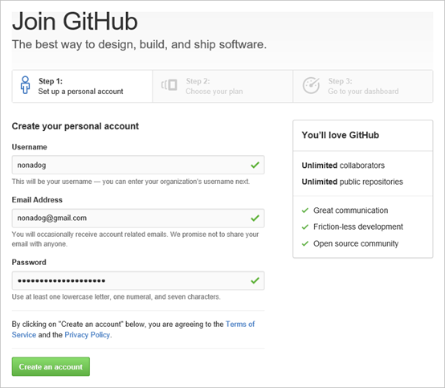
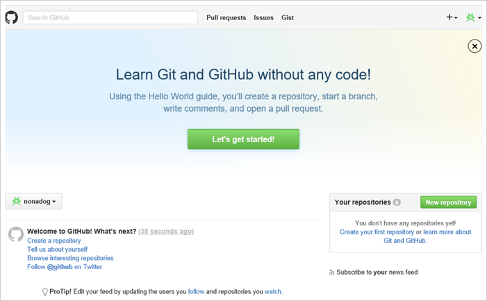
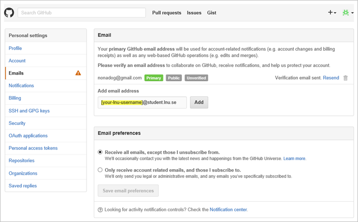

# Your own GitHub-account

Here you will find step by step instruction to create your own Github account.

>To be able to follow all steps in this guide, you need access to the email-address given to you by Linnaeus University. In other words you need to have a [student account](https://lnu.se/utbildning/under-studierna/it-och-support/guider/studentkonto/skapa-ett-studentkonto/). The email address is needed to verify that you are a student so that you get acces to additional resources on GitHub. 

## Step 1. Create your personal account

> If you have a GitHub-accound? Go to step 4. 

Navigate to [https://github.com/join](https://github.com/join) to create a new GitHub-account. Fill in username, email, password and click __Create an account__.

> :bulb: __TIP!__ Choose a username not directly associated with your Linnaeus username. Also use a private email address so you can keep your account for private things. 

## Step 2. Continue the guide

Verify that __Unlimited public repositories for free.__ under __Choose your personal plan__ is selected and click __Finish sign up__.

> You dont have to pay for private repositories since you will get access to them when you register your account as a student account.

## Step 3. Your GitHub-account has been created

Congratulations! You have now created your own GitHub-account. Some details remain, so continue to follow this guide.

## Step 4. Connect your student-email address to your GitHub account

> If you used your student email in step one, go to step 5.

Go to [`https://github.com/settings/emails`](https://github.com/settings/emails) to connect your student email to your GitHub account.

## Step 5. Tell GitHub you are a student

go to [`https://education.github.com`](https://education.github.com) to register yourself as a student. Click __Request a discount__ and follow the instructions.
> __NOTE!__ To follow the instructions you must have verified your student email.

## Step 6. Done!

Now is everything ready to use your account.
